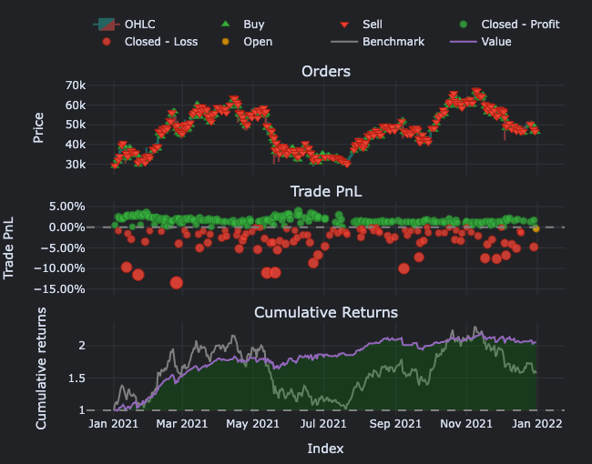
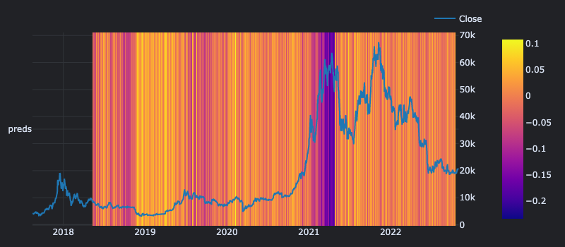
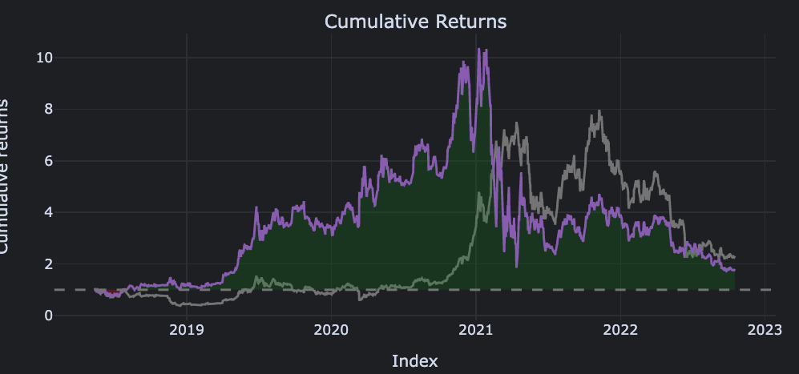

# Daily sigma trading Repo
This was an initial notebook that I'm using to learn Vectorbt and share/teach othere.

The file [daily_sigma.ipynb](daily_sigma.ipynb) walks through how to set up multiple standard deviations then create buy and sell signals and backtest a hypothetical portfolio simulation. I was looking for a strategy that would have thousands and thousands of trades so I could filter it down and work with overlapping signals, etc. 

It wasn't the purpose of this exercise, but hey, the results are pretty promising. 

The [modeling.ipynb](modeling.ipynb) is also a vectorbt training notebook. I took an example from the documentation and then built on it as well as commented it a bit. Here we make predictions on the direction of the market in the future and calculate a probability of an up or downtrend. Generating the following signal  then we run a quick backtest on the signals. Looks like the model was pretty good pre-2021 but then went to hell in 2022 and beyond. 

The new_high_new_low file has some work in there for paramater optimization. 
